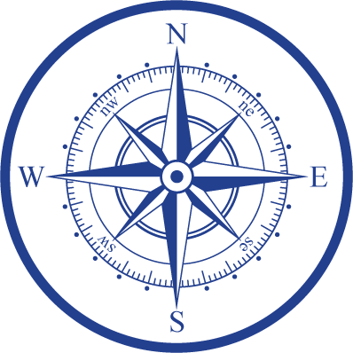

# Kort ᚦᛚ

A mapping tool for Valheim's hardcore / nomap mode.

## How to Map

Kort was developed during [Jotunheim's](https://valheimservers.net/listing/jotunheim) "hardcore" nomap/noportal era, as a support tool for the adventures of a small group of Viking friends.

The core mapping loop is very simple: move to a location, press F5, type `pos`, and enter coordinates into kort. Move a ways along the shore, repeat.

As kortographers run this loop, regions of the Valheim World will begin to emerge.

If players make use of Outlines (for regions), Tracks (for roads, bridges, sailing courses), and Markers (for standalone labels), the emerging world will be rich and offer a strong sense of place.

In more difficult biomes (swamp, plains, mistlands, etc), we spent more time mapping as pairs; one to manage coordinates and the other as defense and support. Often we'd bring two longships with food and as storage for the many materials we'd incidentally pick up. We died. Often. I've never had more fun in Valheim.

For multiple players working together, kort's ping feature (bottom right) is real-time - other players will see your pings on their map. This supports collaborative navigation on boats - one player to ping coordinates, and another to actually pilot the craft.

On Jotunheim, mapping serves the additional role as motivation to get out and see the world, and to experience all the wonderful things the community has created.

For thoughts on `nomap` more generally, "bustedclutch" on Steam has written [a very in-depth guide](https://steamcommunity.com/sharedfiles/filedetails/?id=2906268064) to having fun in a nomap Valheim seed. There's lots to the experience - kortography is just one small part.

## Features

- Large pannable/zoomable world map
- Multi-user support
- Record Markers, Tracks, and Outlines
    - Marker: record a point of interest
    - Track: record a path taken, such a road or sailing voyage
    - Outline: record the borders of an area, such as an island or lake
- Point and track list for managing points
- Ping current location on map
    - With live pings from other kortographers
- Search point labels to find previous markers quickly

## What does Kort mean?

It's from the [Old Norse word kort](https://en.wiktionary.org/wiki/kort#Icelandic) ("a map"), also from Middle High German karte, from Old French carte, from Latin charta ("papyrus, paper"). Related to Danish kort ("a map") and German Karte ("a card; a map").

## Valheim includes a map - why use nomap + this?

Fair enough - Valheim's integrated map is much more convenient than manually building a map with kort. For players living in a nomap world (whether by personal preference or because they're playing in a shared world with nomap enabled), this tool can fill the role of a "hard mode" map. Certainly kort will only be interesting to a specific niche of Valheim players. That's ok by us!

In practice, we found mapping with kort to be a fun and satisfying way to experience Valheim. Often "what do we still need to map?" was all the prompting needed to set off on a great adventure. If it turns out to be a rare need - the act of building kort and mapping Jotunheim was enjoyable in it's own right. We're happy to share - if you use kort in your own Valheim adventures, we'd love to hear from you and see your maps!

## Running Kort

Run the server:

Run `go build` to produce the `kort` binary.

The server can be run with `./kort`, which will automatically start the api/web server.

`kort` can also manage users with `./kort add-user` and `./kort edit-permissions`

See `./kort --help` for more

See the [Point Exports](static/backup/Readme.md) page for sample points and backup `js` snippets.

## Coming Soon

- Multiplayer Live Point additions
- UI improvements
    - Active poly highlight styling
    - Hide/show Tracks and Markers
- Multi-map support
- In UI user-management

## See also

HTTP Server-sent-events: https://github.com/bmhatfield/sse
